What is `Project Moonshine`?
===

**Moonshine** is a high-proof distilled spirit produced illicitly, without government authorization. Still in a ***vaporware*** *phase*, the final product will be called **`Jarwin OS`**, an enanched version of **`Darwin OS`**, the ***`core OS`*** of **Apple**'s codebase.

**Jarwin** aims to replace **Darwin** transparently for **Apple**'s software deployment and also to be a full improved *`UNIX_OS`* with some new and strange features outside the *`UNIX_world`*:
